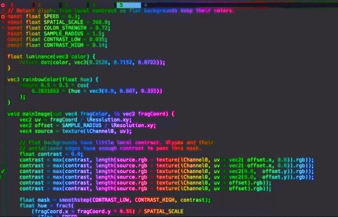

# ghostty-rainbow-shader

Ghosttyの文字を、時間とともに流れる虹色に変換するカスタムシェーダーです。

周囲とのコントラストから文字領域を抽出し、平坦な背景の色を維持します。また、元の表示の明度と透明度を維持します。



## インストール

リポジトリを任意の場所へクローンします。

```sh
mkdir -p ~/.config/ghostty/shaders
git clone https://github.com/sgtakeru/ghostty-rainbow-shader.git \
  ~/.config/ghostty/shaders/ghostty-rainbow-shader
```

Ghosttyの設定ファイル（通常は `~/.config/ghostty/config`）へ次の行を追加します。

```ini
custom-shader = ~/.config/ghostty/shaders/ghostty-rainbow-shader/rainbow.glsl
```

設定を再読み込みすると、開いているターミナルにも反映されます。

シェーダーが動作しない場合は、Ghosttyのログでコンパイルエラーを確認してください。

無効にするには、追加した `custom-shader` の行を削除するかコメントアウトします。

## カスタマイズ

[`rainbow.glsl`](rainbow.glsl) 冒頭の定数で見た目を調整できます。

| 定数 | 内容 |
| --- | --- |
| `SPEED` | 虹が流れる速度 |
| `SPATIAL_SCALE` | 画面内に現れる色相の幅 |
| `COLOR_STRENGTH` | 文字に加える虹色の強さ |
| `SAMPLE_RADIUS` | 文字判定に使う周辺ピクセルまでの距離 |
| `CONTRAST_LOW` | 虹色の適用を始めるコントラスト |
| `CONTRAST_HIGH` | 虹色を完全に適用するコントラスト |

継続的な再描画を止め、端末の表示が更新されたときだけシェーダーを描画する場合は、Ghosttyの設定へ次を追加します。

```ini
custom-shader-animation = false
```

## 必須環境

- Ghosttyのカスタムシェーダー機能を利用できる環境

GhosttyのカスタムシェーダーはShadertoy互換の `mainImage` 関数を使用します。

詳しい仕様は[Ghosttyの設定リファレンス](https://ghostty.org/docs/config/reference#custom-shader)を参照してください。

## 謝辞

[shibadogcap/dpgk](https://github.com/shibadogcap/dpgk)にインスパイアされ、その虹色表現を参考にしています。

## ライセンス

[MIT License](LICENSE)
